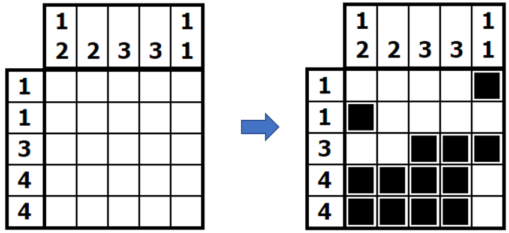
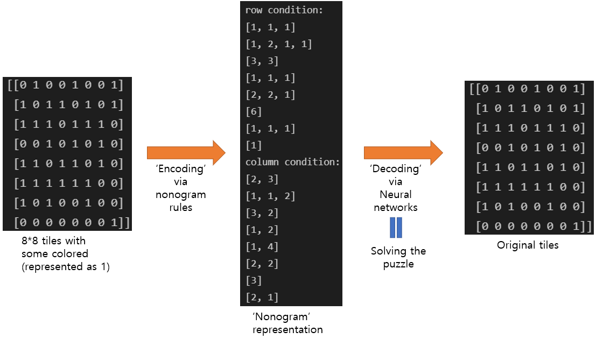
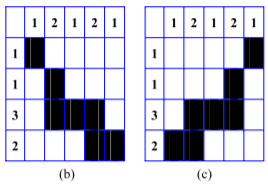

# Solving Nonograms with Neural Networks

<div style="text-align: right"> 2020191087 최수호 </div>

## 1. What is a nonogram?

Nonogram is a popular puzzle in Japan and Netherlands.

A simple nonogram consists of positive integers in the top of a column of left of a row stand for the lengths of black runs in the column or row, respectively. The goal is to paint cells to form a picture that satisfies the following constraints:

1. Each cell must be coloured (black) or left empty (white)
2. If a row or column has $k$ numbers: $$ s_1, s_2, ..., s_k$$, then it must contain $k$ black runs - the first (leftmost for rows/topmost for columns) black run with length $s_1$, the second black run with length $s_2$, and so on.
3. There should be at least one empty cell between two consecutive black runs.

Yu, CH., Lee, HL. & Chen, LH. An efficient algorithm for solving nonograms. Appl Intell 35, 18–31 (2011)


```python
from IPython.display import Image
Image(filename = 'example.png')
```





<div style="text-align: center"> [Fig1. An Example of a solved nonogram.] </div>

## 2. Related Works

Various algorithms for solving nonograms have been studied, including genetic algorithm, and depth first search (DFS) algorithm. Also, DFS algorithms with additional logical rules first applied have been studied.

## 3. Methods

We would like to view to process of making nonograms out of coloured puzzles as 'encoding', 
And solving the process of Nonograms as 'decoding'.


```python
Image(filename = 'example2.png')
```





<div style="text-align: center"> [Fig 2. The encoder-decoder perspective of nonogram making and solving.] </div> 

So, the 'encoding' process is done easily by conventional laws of nonograms stated above.
We are observing whether deep neural networks can serve as a 'decoder', thus reconstructing the original tiles from the 'nonogram' representation. (Solving)
However, we may meet some problems. First, some nonograms have more than one solution: The algorithm may not be able to solve it or reach a local minima. Also, it remains a problem how to feed the neural network with appropriate input.


```python
Image(filename = 'example3.png')
```





<div style="text-align: center"> [Fig 3. An example of nonogram puzzles with two solutions.] </div> 

We would like to focus on solving $8\times8$ nonograms.
Random nonograms will be generated (encoded) from $8\times8$ tiles with randomly coloured tiles.
*Using the nonograms (encoded representations) as input, and random coloured tiles as labels*, we will train the neural network in a supervised way.
It remains a doubt whether the neural network will be able to learn cetain patterns that can be derived from logical rules.
